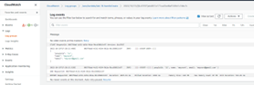
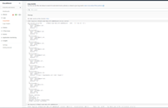
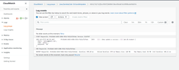
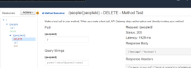
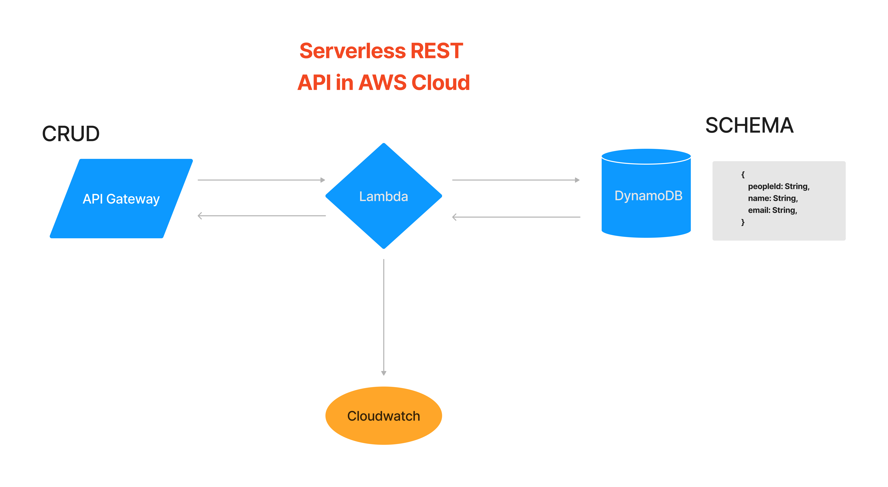

# Serverless API - Lab 18

## Author: Alan Chelko
  
    * Collaboration: in-class demos, Robert Ball, Felix Yu (via youtube: <https://www.youtube.com/watch?v=Ut5CkSz6NR0&t=280s>)

## Problem Domain

    * Create a serverless REST API in the AWS Cloud with AWS Lambda, API Gateway and DynamoDB

## Feature Tasks & Requirements

    * Database: DynamoDB
      * 1 Table required
    * Routing: API Gateway
      * Set up a /people route with following CRUD functionality:
        * GET (all)
        * POST
      * Set up a /people/id route with following CRUD functionality:
        * GET (single item)
        * DELETE 
        * PUT
      * CRUD Operation Handlers: Lambda Functions

## Documentation

### CREATE

### READ

### UPDATE

### DELETE

### UML: Serverless REST API in AWS Cloud

